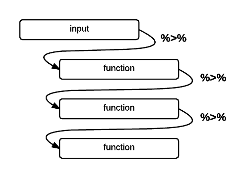

# Basic Operations

Let's start off by creating a new R script and loading `tidyverse`:

```{r message = FALSE}
library(tidyverse)
```

Clear everything to make sure there's nothing leftover in our environment

```{r}
rm(list = ls())
```

## Data pipelines

Dplyr makes it easy to "chain" functions together using the *pipe* operator `%>%`. The following diagram illustrates the general concept of pipes where data flows from one pipe to another until all the processing is completed.



The syntax of the pipe operator `%>%` might appear unusual at first, but once you get used to it you’ll start to appreciate its power and flexibility.

## Dataset

We're using a dataset of flight departures from Houston in 2011.

| Filename | Description |
|-|--------------------------------------------------------------------------------------------------------------------------------------------------|
| flights.csv | Flight departures from Houston in 2011 |
| weather.csv | Hourly weather |
| planes.csv | Metadata for planes |
| airports.csv | Metadata for airports |

We're going to use the `readr` package which provides improved functions for reading datasets from files. Instead of the usual `read.csv()` function, we'll use the `read_csv()` function from `readr`.

```{r message = FALSE}
flights <- read_csv("https://raw.githubusercontent.com/altaf-ali/tidydata_tutorial/master/data/flights.csv")
weather <- read_csv("https://raw.githubusercontent.com/altaf-ali/tidydata_tutorial/master/data/weather.csv")
planes <- read_csv("https://raw.githubusercontent.com/altaf-ali/tidydata_tutorial/master/data/planes.csv")
airports <- read_csv("https://raw.githubusercontent.com/altaf-ali/tidydata_tutorial/master/data/airports.csv")
```

Now let's examine the dataset

```{r}
flights
weather
planes
airports
```

Notice that because we used `read_csv()`, the data frame we received now prints nicely without having to use the `head()` function and does not clutter your screen.

## Select

The `select` function is used to select columns.

- Select the destination, duration and distance columns (`dest`, `time` and `dist`)

```{r}
flights %>%
  select(dest, time, dist)
```

Add the arrival delay (`arr_delay`) and departure delay (`dep_delay`) columns as well.

```{r}
flights %>%
  select(dest, time, dist, arr_delay, dep_delay)
```

Other ways to do the same

```{r}
flights %>%
  select(dest, time, dist, ends_with("delay"))
```

and ...

```{r}
flights %>%
  select(dest, time, dist, contains("delay"))
```

Select all columns from `date` to `arr`

```{r}
flights %>%
  select(date:arr)
```

Select all *except* `plane` column using the *minus* sign

```{r}
flights %>%
  select(-plane)
```

## Filter

The `filter()` function returns rows with matching conditions. We can find all flights to Boston (BOS) like this:

```{r}
flights %>%
  filter(dest == "BOS")
```

Let's build on the previous exercise and find all flights to Boston (BOS) and select only the `dest`, `time`, `dist` columns:

```{r}
flights %>%
  select(dest, time, dist) %>%
  filter(dest == "BOS")
```

Now let's do the filter first and then select the columns

```{r}
flights %>%
  filter(dest == "BOS") %>%
  select(dest, time, dist) 
```

In this case the order doesn't matter, but when using pipes make sure you understand that each function is executed in sequence and the results are then fed to the next one.

### Exercise

Find all flights that match the following conditions:

1. To SFO or OAK
1. In January
1. Delayed by more than an hour
1. Departed between midnight and 5am
1. Arrival delay more than twice the departure delay

Here's a brief summary of operators you can use:

**Comparison Operators**

```{r echo = FALSE}
tribble(
  ~Operator, ~Description, ~`Example (assume x is 5)`, ~Result,
  ">", "greater than", "x > 5", "FALSE",
  ">=", "greater than or equal to", "x >= 5", "TRUE",
  "<", "less than", "x < 5", "FALSE",
  "<=", "less than or equal to", "x <= 5", "TRUE",
  "==", "equal to", "x == 5", "TRUE",
  "!=", "not equal to", "x != 5", "FALSE"
) %>%
  knitr::kable()
```

**Logical Operators**

```{r echo = FALSE}
tribble(
  ~Operator, ~Description, 
  "!", "not",
  "|", "or",
  "&", "and"
) %>%
  knitr::kable()
```

**Other Operators**

```{r echo = FALSE}
tribble(
  ~Operator, ~Description, ~`Example (assume x is 5)`, ~Result,
  "%in%", "check element in a vector", "x %in% c(1, 3, 5, 7)<br>x %in% c(2, 4, 6, 8)", "TRUE<br>FALSE"
) %>%
  knitr::kable()
```

## Arrange

The `arrange()` function is used to sort the rows based on one or more columns

```{r}
flights %>%
  arrange(dest)
```

### Exercise

1. Order flights by departure date and time
1. Which flights were most delayed?
1. Which flights caught up the most time during flight?

## Mutate

The `mutate()` function is used to create new variables.

Up until now we've only been examining the dataset but haven't made any changes to it. All our functions so far have simply displayed the results on screen but haven't created or modified existing variables. Let's see how we can create a new variable called `speed` based on the distance and duration in the flights dataframe.

In this exercise we're adding a new variable to an existing dataframe so we'll just overwrite the `flights` variable with the one that has a `speed` column

```{r}
flights <- flights %>%
  mutate(speed = dist / (time / 60))
```

### Exercise

1. Add a variable to show how much time was made up (or lost) during flight

## Summarise

Let's count the number of flights departing each day. 

```{r}
flights %>%
  group_by(date) %>%
  summarise(count = n()) 
```

Here's a nice little trick. You can use `View()` to look at the results of a pipe operation without creating new variables.

```{r eval = FALSE}
flights %>%
  group_by(date) %>%
  summarise(count = n()) %>%
  View()
```

Of course, often times we'd want to save the summary in a variable for further analysis.

Let's find the average departure delay for each destination

```{r}
delays <- flights %>%
    group_by(dest) %>%
    summarise(mean = mean(dep_delay))

delays
```

### Exercise

1. What's wrong with the results above, and how would you fix the problem?
1. Can you think of using filter to solve the problem?
1. Use help to find out two other ways to do summarize/n combination in dplyr.
1. How many different destinations can you fly to from Houston?
1. Which destinations have the highest average delays?
1. Which flights (carrier + flight number) happen everyday and where do they fly?
1. How do delays (of non-cancelled flights) vary over the course of a day? 

## Unite

The `unite` function is useful for combining multiple columns together. In the example below, we join the `carrier` and `flight` to create a unique `flight_id` column.

```{r}
flights %>%
  unite(flight_id, carrier, flight, sep = "-", remove = FALSE) %>%
  select(date, carrier, flight, flight_id)
```

## Separate

The `separate` function works the other way around by splitting a single column into multiple columns. Let's split the `date` column into separate `date` and `time` columns.

```{r}
flights %>%
  separate(date, c("date", "time"), sep = " ")
```

### Exercise

1. Split the `date` column into `year`, `month`, and `day` columns
1. Ensure that the `year`, `month`, and `day` columns are of type *integer* (NOT *character*)
    - HINT: Use online help for `separate` for an easy way to do this
    
    
